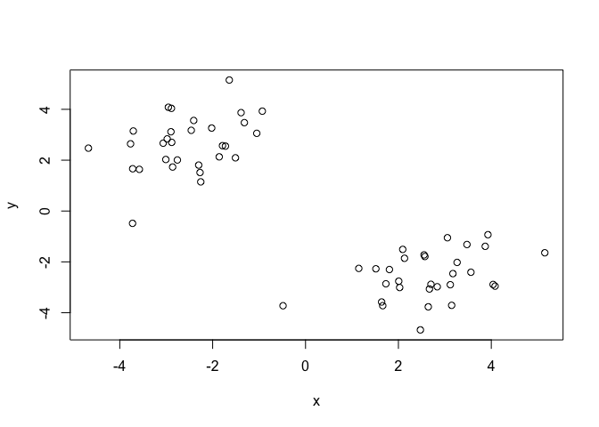
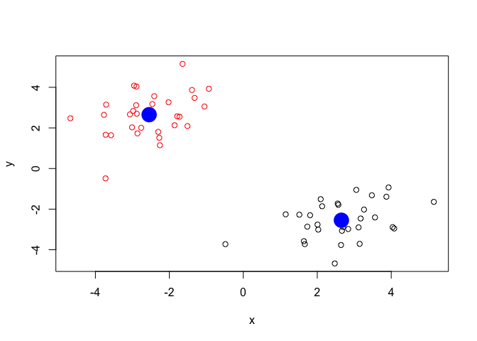
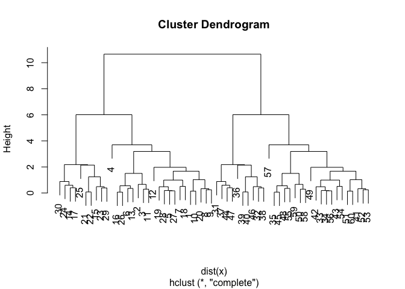
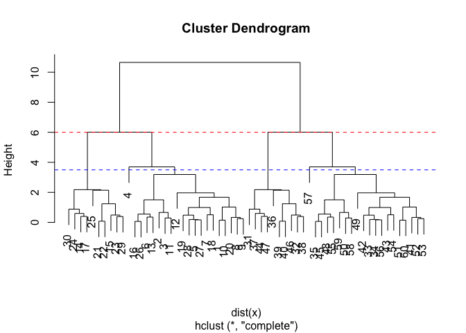
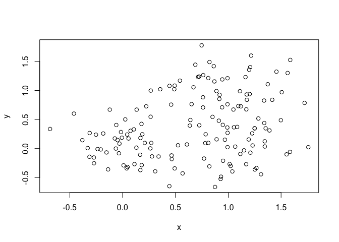
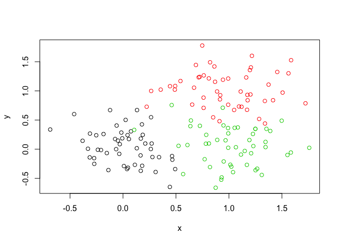
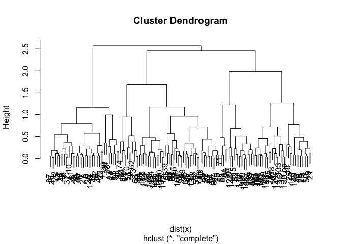
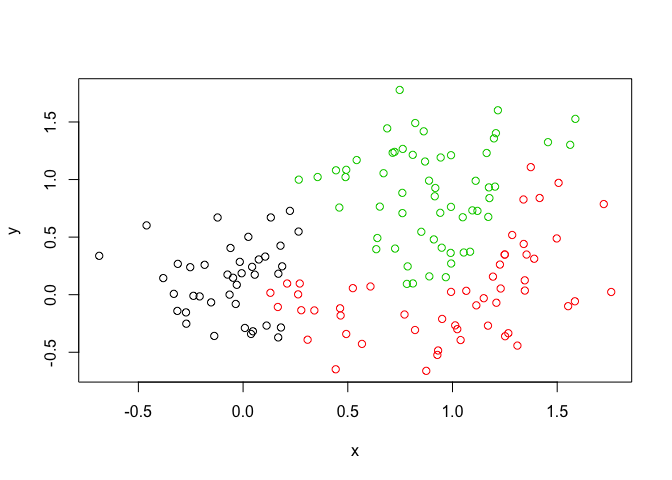
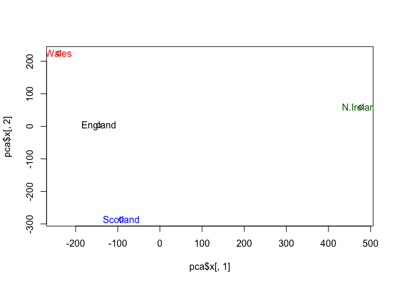

Class8
================
Rimma Levina
2/5/2020

## K-means clustering

Lets try the `kmeans()` function in R to cluster some made up example
data

``` r
tmp <- c(rnorm(30,-3), rnorm(30,3)) #this makes up data, 1st = 30 points centered around -3, 2nd = 30 points centered around +3 --> makes a vector that has 60 points

x <- cbind(x=tmp, y=rev(tmp)) # cbind() binds together vectors, you are also setting the axes, where x is the first vector and y is the reverse (rev()) of the tmp vector, then you plot and see you have 2 groups that are clearly separate/clustered
 
plot(x)
```

<!-- --> Use the
kmeans() function setting k to 2 and nstart=20 Inspect/print the results
Q. How many points are in each cluster? Q. What ‘component’ of your
result object details - cluster size?  
\- cluster assignment/membership?  
\- cluster center?

Plot x colored by the kmeans cluster assignment and add cluster centers
as blue points

``` r
km <- kmeans(x = x, centers = 2, nstart = 20) 
km
```

    ## K-means clustering with 2 clusters of sizes 30, 30
    ## 
    ## Cluster means:
    ##           x         y
    ## 1  2.652754 -2.546680
    ## 2 -2.546680  2.652754
    ## 
    ## Clustering vector:
    ##  [1] 2 2 2 2 2 2 2 2 2 2 2 2 2 2 2 2 2 2 2 2 2 2 2 2 2 2 2 2 2 2 1 1 1 1 1 1 1 1
    ## [39] 1 1 1 1 1 1 1 1 1 1 1 1 1 1 1 1 1 1 1 1 1 1
    ## 
    ## Within cluster sum of squares by cluster:
    ## [1] 58.93093 58.93093
    ##  (between_SS / total_SS =  87.3 %)
    ## 
    ## Available components:
    ## 
    ## [1] "cluster"      "centers"      "totss"        "withinss"     "tot.withinss"
    ## [6] "betweenss"    "size"         "iter"         "ifault"

attributes(km) is a function to get the details of your
    data

``` r
km$size
```

    ## [1] 30 30

``` r
km$cluster
```

    ##  [1] 2 2 2 2 2 2 2 2 2 2 2 2 2 2 2 2 2 2 2 2 2 2 2 2 2 2 2 2 2 2 1 1 1 1 1 1 1 1
    ## [39] 1 1 1 1 1 1 1 1 1 1 1 1 1 1 1 1 1 1 1 1 1 1

``` r
table(km$cluster)
```

    ## 
    ##  1  2 
    ## 30 30

Now plot colored by the kmeans cluster assignment, and add cluster
centers as blue points so find CENTERS, then add to exsiting plot

``` r
plot(x, col=km$cluster)
points(km$centers, col="blue", pch=16, cex=3)
```

<!-- -->

## Hierarchical clustering in R

The `hclust()` function is the main hierarchical clustering method in R
and it MUST BE PASSED THROUGH A MATRIX AS INPUT, not your raw
data\!\!\!\!

``` r
hc <- hclust( dist(x))  # this hopefully reveals patterns in your data
plot(hc)
```

<!-- -->

``` r
plot(hc)
abline(h=6, col="red", lty= 2)# makes a line above where you want to cut off the data
abline(h=3.5, col="blue", lty= 2)
```

<!-- -->

``` r
cutree(hc, h=6)  # lists all the points below that line you cut
```

    ##  [1] 1 1 1 1 1 1 1 1 1 1 1 1 1 2 2 1 2 1 1 1 2 2 2 2 2 1 1 1 2 2 3 3 4 4 4 3 3 3
    ## [39] 3 3 4 4 4 3 4 3 3 4 4 4 4 4 4 4 4 4 4 4 4 4

You can call cutree with `k` for the number of groups you want, or with
`h` for
    height

``` r
cutree(hc, k=6) # having a lower cut off you see now you have 6 clusters
```

    ##  [1] 1 1 1 2 1 1 1 1 1 1 1 1 1 3 3 1 3 1 1 1 3 3 3 3 3 1 1 1 3 3 4 4 5 5 5 4 4 4
    ## [39] 4 4 5 5 5 4 5 4 4 5 5 5 5 5 5 5 5 5 6 5 5 5

## Linkage

``` r
# Step 1. Generate some example data for clustering
x <- rbind(
 matrix(rnorm(100, mean=0, sd=0.3), ncol = 2), # c1
 matrix(rnorm(100, mean=1, sd=0.3), ncol = 2), # c2
 matrix(c(rnorm(50, mean=1, sd=0.3), # c3
 rnorm(50, mean=0, sd=0.3)), ncol = 2))
colnames(x) <- c("x", "y")
# Step 2. Plot the data without clustering
plot(x)
```

<!-- -->

``` r
# Step 3. Generate colors for known clusters
# (just so we can compare to hclust results)
col <- as.factor( rep(c("c1","c2","c3"), each=50) )
plot(x, col=col)
```

<!-- -->

Q. Use the dist() for distance matrix, hclust(), plot() and cutree()
functions to return 2 and 3 clusters Q. How does this compare to your
known ‘col’ groups?

``` r
hc <- hclust(dist(x))
plot(hc)
```

<!-- -->

``` r
grps2 <- cutree(hc, k=2)
grps3 <- cutree(hc, k=3) #these are membership vectors
```

``` r
table(grps2)
```

    ## grps2
    ##   1   2 
    ##  40 110

``` r
table(grps3)
```

    ## grps3
    ##  1  2  3 
    ## 40 53 57

``` r
plot(x, col=grps3) # color by the group distribution
```

<!-- -->

``` r
table(grps3, col) #this is a cross table, using col from line 102, saying for group 1 all 42 points come from cluster 1, for group 2 most points come from cluster 3, for group 3 most points come from cluster 2 - so only group 1 is mostly right
```

    ##      col
    ## grps3 c1 c2 c3
    ##     1 38  1  1
    ##     2 12  7 34
    ##     3  0 42 15

# Principle Component Analysis (PCA)

The main function in R for PCA is called `prcomp()`. Here we will use
PCA to examine the funny food that folks eat in the UK and N. Ireland.

Import the CSV file first:

``` r
x <- read.csv("UK_foods.csv", row.names = 1)
x
```

    ##                     England Wales Scotland N.Ireland
    ## Cheese                  105   103      103        66
    ## Carcass_meat            245   227      242       267
    ## Other_meat              685   803      750       586
    ## Fish                    147   160      122        93
    ## Fats_and_oils           193   235      184       209
    ## Sugars                  156   175      147       139
    ## Fresh_potatoes          720   874      566      1033
    ## Fresh_Veg               253   265      171       143
    ## Other_Veg               488   570      418       355
    ## Processed_potatoes      198   203      220       187
    ## Processed_Veg           360   365      337       334
    ## Fresh_fruit            1102  1137      957       674
    ## Cereals                1472  1582     1462      1494
    ## Beverages                57    73       53        47
    ## Soft_drinks            1374  1256     1572      1506
    ## Alcoholic_drinks        375   475      458       135
    ## Confectionery            54    64       62        41

``` r
# Notice that X is the lable for the first column, but you want that to be the row names. You can fix that in the import function, with row.names=1
```

``` r
barplot(as.matrix(x), beside=T, col=rainbow(nrow(x)))
```

<!-- -->

``` r
pairs(x, col=rainbow(10), pch=16)  #Makes a matrix of scatterplots
```

<!-- -->

\#PCA to the
rescue\!

``` r
pca <-prcomp(t(x)) #taking the transpose of x makes the rows the column names
```

``` r
summary(pca)
```

    ## Importance of components:
    ##                             PC1      PC2      PC3       PC4
    ## Standard deviation     324.1502 212.7478 73.87622 4.189e-14
    ## Proportion of Variance   0.6744   0.2905  0.03503 0.000e+00
    ## Cumulative Proportion    0.6744   0.9650  1.00000 1.000e+00

``` r
attributes(pca)
```

    ## $names
    ## [1] "sdev"     "rotation" "center"   "scale"    "x"       
    ## 
    ## $class
    ## [1] "prcomp"

``` r
plot( pca$x[,1], pca$x[,2] )
text(pca$x[,1], pca$x[,2], colnames(x), col=c("black", "red", "blue", "darkgreen"))
```

<!-- -->
