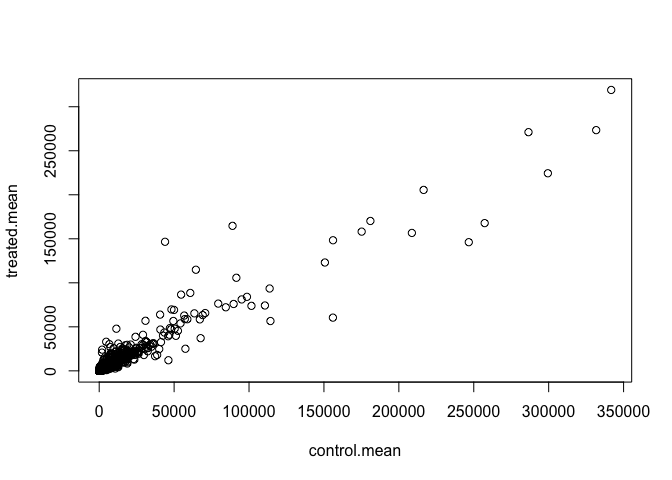
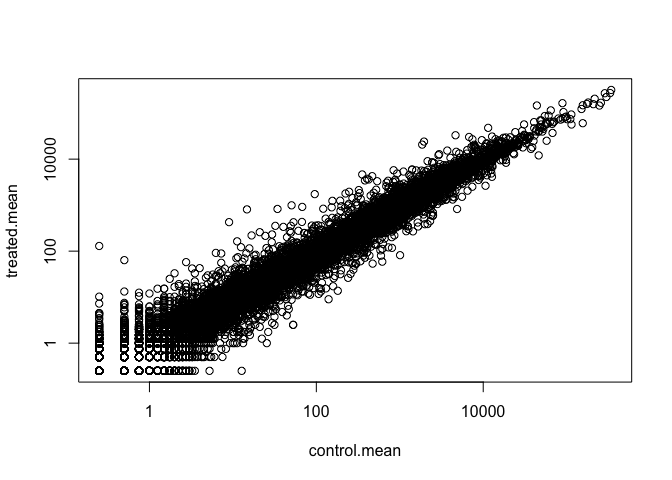
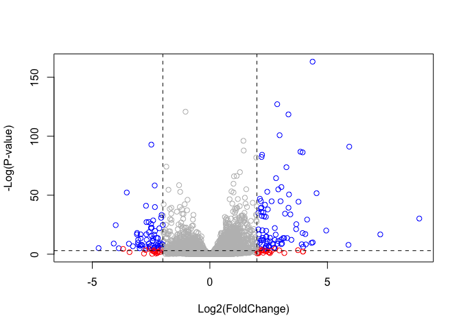

RNA-seq and transcriptomics
================

## Read our data for today

``` r
counts <- read.csv("airway_scaledcounts.csv", stringsAsFactors = FALSE)
metadata <- read.csv("airway_metadata.csv", stringsAsFactors = FALSE)
```

How many genes are we dealing with?

``` r
nrow(counts)
```

    ## [1] 38694

Now we want to just compare, take the average of all the control rows
and all the treated rows. First we will extract the control columns by
looking up their colnames in the `metadata` object

``` r
metadata
```

    ##           id     dex celltype     geo_id
    ## 1 SRR1039508 control   N61311 GSM1275862
    ## 2 SRR1039509 treated   N61311 GSM1275863
    ## 3 SRR1039512 control  N052611 GSM1275866
    ## 4 SRR1039513 treated  N052611 GSM1275867
    ## 5 SRR1039516 control  N080611 GSM1275870
    ## 6 SRR1039517 treated  N080611 GSM1275871
    ## 7 SRR1039520 control  N061011 GSM1275874
    ## 8 SRR1039521 treated  N061011 GSM1275875

We see the dex column has the group info we need, and the ID has the
corresponding counts, so can we extract all the control rows and get
their
average

``` r
metadata[metadata$dex=="control",] #gets all rows that are part of the control group: dex has the distinction, we want only control ROWS
```

    ##           id     dex celltype     geo_id
    ## 1 SRR1039508 control   N61311 GSM1275862
    ## 3 SRR1039512 control  N052611 GSM1275866
    ## 5 SRR1039516 control  N080611 GSM1275870
    ## 7 SRR1039520 control  N061011 GSM1275874

``` r
metadata[metadata$dex=="control",]$id #gets us the name of these columns
```

    ## [1] "SRR1039508" "SRR1039512" "SRR1039516" "SRR1039520"

``` r
control <- metadata[metadata$dex=="control",]
control
```

    ##           id     dex celltype     geo_id
    ## 1 SRR1039508 control   N61311 GSM1275862
    ## 3 SRR1039512 control  N052611 GSM1275866
    ## 5 SRR1039516 control  N080611 GSM1275870
    ## 7 SRR1039520 control  N061011 GSM1275874

Now access the count
columns

``` r
# counts[, control$id]  I commented out the code because it made the markdown file too large

#we've created a path to get all the control rows, which correspond to the COLUMNS in the actual counts data set
```

Now find the mean value for each row (aka each
gene)

``` r
control.mean <- rowSums(counts[, control$id]) / nrow(control) # aka 4 but you want to make this applicable to other data sets
head(control.mean)
```

    ## [1] 900.75   0.00 520.50 339.75  97.25   0.75

Now access the treated rows and make a new vector with their means

``` r
treated <- metadata[metadata$dex=="treated",]
treated
```

    ##           id     dex celltype     geo_id
    ## 2 SRR1039509 treated   N61311 GSM1275863
    ## 4 SRR1039513 treated  N052611 GSM1275867
    ## 6 SRR1039517 treated  N080611 GSM1275871
    ## 8 SRR1039521 treated  N061011 GSM1275875

``` r
# counts[, treated$id] commenting out because it makes the markdown file too large
treated.mean <- rowSums(counts[, treated$id]) / nrow(treated)
```

Lets put these together for ease of use

``` r
mycounts <- data.frame(control.mean, treated.mean)
head(mycounts)
```

    ##   control.mean treated.mean
    ## 1       900.75       658.00
    ## 2         0.00         0.00
    ## 3       520.50       546.00
    ## 4       339.75       316.50
    ## 5        97.25        78.75
    ## 6         0.75         0.00

Lets plot and see what it looks like

``` r
plot(mycounts)
```

<!-- -->

``` r
hist(mycounts$control.mean, breaks = 300)
```

<!-- -->

Whenever you see something like this TAKE THE
LOG

``` r
plot(mycounts, log = "xy") # determines which axis you want to be on the log scale
```

    ## Warning in xy.coords(x, y, xlabel, ylabel, log): 15032 x values <= 0 omitted
    ## from logarithmic plot

    ## Warning in xy.coords(x, y, xlabel, ylabel, log): 15281 y values <= 0 omitted
    ## from logarithmic plot

<!-- -->

Now we’ll try to remove all the zero count genes because we cant say
anything about them from this dataset/theyre messing up our plot

``` r
x <- c(1,3,10,0) #demo
which(x == 0)
```

    ## [1] 4

``` r
y <- data.frame( c(1,3,10,0),
                 c(1,2,0,0))

unique(which(y == 0, arr.ind = TRUE) [, "row"] ) 
```

    ## [1] 4 3

``` r
#this gives us the row and col where the zeros are, more details
#gives us back unique entries
```

Now actually find zero rows in our mycounts object

``` r
to.rm <- unique(which(mycounts == 0, arr.ind = TRUE)[, "row"])
newcounts <- mycounts[-to.rm,] # gives you all the data without the zeros
head(newcounts)
```

    ##   control.mean treated.mean
    ## 1       900.75       658.00
    ## 3       520.50       546.00
    ## 4       339.75       316.50
    ## 5        97.25        78.75
    ## 7      5219.00      6687.50
    ## 8      2327.00      1785.75

``` r
nrow(newcounts)
```

    ## [1] 21817

Now we have 21,817 genes, which is a little more reasonable given what
we know about the number of existing genes, remember to take the
log

``` r
newcounts$log2fc <- log2(newcounts[,"treated.mean"]/newcounts[,"control.mean"])
head(newcounts)
```

    ##   control.mean treated.mean      log2fc
    ## 1       900.75       658.00 -0.45303916
    ## 3       520.50       546.00  0.06900279
    ## 4       339.75       316.50 -0.10226805
    ## 5        97.25        78.75 -0.30441833
    ## 7      5219.00      6687.50  0.35769358
    ## 8      2327.00      1785.75 -0.38194109

Now lets look at the genes that actually changed

``` r
upreg.genes <- newcounts$log2fc > 2 #bc we used log 2
sum(upreg.genes)
```

    ## [1] 250

``` r
downreg.genes <- newcounts$log2fc < (-2) 
sum(downreg.genes)
```

    ## [1] 367

## Lets use DESeq2

``` r
library(DESeq2)
```

    ## Loading required package: S4Vectors

    ## Loading required package: stats4

    ## Loading required package: BiocGenerics

    ## Loading required package: parallel

    ## 
    ## Attaching package: 'BiocGenerics'

    ## The following objects are masked from 'package:parallel':
    ## 
    ##     clusterApply, clusterApplyLB, clusterCall, clusterEvalQ,
    ##     clusterExport, clusterMap, parApply, parCapply, parLapply,
    ##     parLapplyLB, parRapply, parSapply, parSapplyLB

    ## The following objects are masked from 'package:stats':
    ## 
    ##     IQR, mad, sd, var, xtabs

    ## The following objects are masked from 'package:base':
    ## 
    ##     anyDuplicated, append, as.data.frame, basename, cbind, colnames,
    ##     dirname, do.call, duplicated, eval, evalq, Filter, Find, get, grep,
    ##     grepl, intersect, is.unsorted, lapply, Map, mapply, match, mget,
    ##     order, paste, pmax, pmax.int, pmin, pmin.int, Position, rank,
    ##     rbind, Reduce, rownames, sapply, setdiff, sort, table, tapply,
    ##     union, unique, unsplit, which, which.max, which.min

    ## 
    ## Attaching package: 'S4Vectors'

    ## The following object is masked from 'package:base':
    ## 
    ##     expand.grid

    ## Loading required package: IRanges

    ## Loading required package: GenomicRanges

    ## Loading required package: GenomeInfoDb

    ## Loading required package: SummarizedExperiment

    ## Loading required package: Biobase

    ## Welcome to Bioconductor
    ## 
    ##     Vignettes contain introductory material; view with
    ##     'browseVignettes()'. To cite Bioconductor, see
    ##     'citation("Biobase")', and for packages 'citation("pkgname")'.

    ## Loading required package: DelayedArray

    ## Loading required package: matrixStats

    ## 
    ## Attaching package: 'matrixStats'

    ## The following objects are masked from 'package:Biobase':
    ## 
    ##     anyMissing, rowMedians

    ## Loading required package: BiocParallel

    ## 
    ## Attaching package: 'DelayedArray'

    ## The following objects are masked from 'package:matrixStats':
    ## 
    ##     colMaxs, colMins, colRanges, rowMaxs, rowMins, rowRanges

    ## The following objects are masked from 'package:base':
    ## 
    ##     aperm, apply, rowsum

Set up of the object required by DESeq

``` r
dds <- DESeqDataSetFromMatrix(countData=counts, 
                              colData=metadata, 
                              design=~dex, 
                              tidy=TRUE)
```

    ## converting counts to integer mode

    ## Warning in DESeqDataSet(se, design = design, ignoreRank): some variables in
    ## design formula are characters, converting to factors

``` r
dds
```

    ## class: DESeqDataSet 
    ## dim: 38694 8 
    ## metadata(1): version
    ## assays(1): counts
    ## rownames(38694): ENSG00000000003 ENSG00000000005 ... ENSG00000283120
    ##   ENSG00000283123
    ## rowData names(0):
    ## colnames(8): SRR1039508 SRR1039509 ... SRR1039520 SRR1039521
    ## colData names(4): id dex celltype geo_id

``` r
dds <- DESeq(dds)
```

    ## estimating size factors

    ## estimating dispersions

    ## gene-wise dispersion estimates

    ## mean-dispersion relationship

    ## final dispersion estimates

    ## fitting model and testing

``` r
res <- results(dds)
res
```

    ## log2 fold change (MLE): dex treated vs control 
    ## Wald test p-value: dex treated vs control 
    ## DataFrame with 38694 rows and 6 columns
    ##                          baseMean     log2FoldChange             lfcSE
    ##                         <numeric>          <numeric>         <numeric>
    ## ENSG00000000003  747.194195359907 -0.350703020686579 0.168245681332529
    ## ENSG00000000005                 0                 NA                NA
    ## ENSG00000000419  520.134160051965  0.206107766417861 0.101059218008052
    ## ENSG00000000457  322.664843927049 0.0245269479387471 0.145145067649248
    ## ENSG00000000460   87.682625164828  -0.14714204922212 0.257007253994673
    ## ...                           ...                ...               ...
    ## ENSG00000283115                 0                 NA                NA
    ## ENSG00000283116                 0                 NA                NA
    ## ENSG00000283119                 0                 NA                NA
    ## ENSG00000283120 0.974916032393564  -0.66825846051647  1.69456285241871
    ## ENSG00000283123                 0                 NA                NA
    ##                               stat             pvalue              padj
    ##                          <numeric>          <numeric>         <numeric>
    ## ENSG00000000003   -2.0844696749953 0.0371174658432827 0.163034808641681
    ## ENSG00000000005                 NA                 NA                NA
    ## ENSG00000000419    2.0394751758463 0.0414026263001167 0.176031664879168
    ## ENSG00000000457  0.168982303952746  0.865810560623561 0.961694238404388
    ## ENSG00000000460  -0.57252099672319  0.566969065257939 0.815848587637724
    ## ...                            ...                ...               ...
    ## ENSG00000283115                 NA                 NA                NA
    ## ENSG00000283116                 NA                 NA                NA
    ## ENSG00000283119                 NA                 NA                NA
    ## ENSG00000283120 -0.394354484734893  0.693319342566817                NA
    ## ENSG00000283123                 NA                 NA                NA

Time to visualize the data\! Volcano Plot - plot of fold change vs
adjusted pvalue

``` r
plot(res$log2FoldChange, - log(res$padj),
          xlab="Log2(FoldChange)",
         ylab="-Log(P-value)", col = "grey")
```

<!-- -->

``` r
# Setup our custom point color vector 
mycols <- rep("gray", nrow(res))
mycols[ abs(res$log2FoldChange) > 2 ]  <- "red" 

inds <- (res$padj < 0.01) & (abs(res$log2FoldChange) > 2 )
mycols[ inds ] <- "blue"

# Volcano plot with custom colors 
plot( res$log2FoldChange,  -log(res$padj), 
 col=mycols, ylab="-Log(P-value)", xlab="Log2(FoldChange)" )

#setting up boundaries
abline(v=c(-2,+2), lty=2) 
abline(h=c(-log(0.05)), lty = 2)
```

<!-- -->
