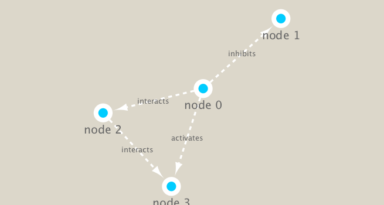

```{r setup, include=FALSE}
knitr::opts_chunk$set(echo = TRUE)
```

## Coronavirus (and HW)

Here we analyze infection data for the 2019 novel Coronavirus COVID-19 (2019-nCoV) epidemic. The raw data is pulled from the Johns Hopkins University Center for Systems Science and Engineering (JHU CCSE) Coronavirus repository.

A CSV file is available here https://github.com/RamiKrispin/coronavirus-csv

```{r}
url <- "https://tinyurl.com/COVID-2019"
virus <- read.csv(url)

tail(virus)
```

```{r}
#library(dplyr) #functions in dplyr:
# group_by
# summarise
# arrange
# you can build these functions on one another by using %>% 
```


> Q1. How many total cases around the world?

```{r}
total <- sum(virus$cases)
total
```

> Q2. How many deaths linked to infected cases have there been?

```{r}
table(virus$type)
inds <- virus$type == "death"
virus[inds, ]
```

```{r}
totaldeaths <- sum(virus[inds, "cases"])
totaldeaths
```


> Q3. What is the overall dealth rate?

```{r}
round(totaldeaths/total * 100, 2)
```


> Q4. What is the death rate in Mainland China?

```{r}
totalchina <- virus$Country.Region == "Mainland China"
tc<- sum(virus[totalchina, "cases"])

chinadeath <- virus$type == "death" & virus$Country.Region == "Mainland China"
cd<- sum(virus[chinadeath, "cases" ])

round(cd/tc * 100, 2)

```


> Q5. What is the death rate in Italy, Iran, and the US?

```{r}
#Italy

totalitaly <- virus$Country.Region == "Italy"
ti<- sum(virus[totalitaly, "cases"])

italydeath <- virus$type == "death" & virus$Country.Region == "Italy"
id<- sum(virus[italydeath, "cases" ])

round(id/ti * 100, 2)
```

```{r}
#Iran

totaliran <- virus$Country.Region == "Iran"
tir<- sum(virus[totaliran, "cases"])

irandeath <- virus$type == "death" & virus$Country.Region == "Iran"
ird<- sum(virus[irandeath, "cases" ])

round(ird/tir * 100, 2)
```

```{r}
#US

totalUS <- virus$Country.Region == "US"
tUS<- sum(virus[totalUS, "cases"])

USdeath <- virus$type == "death" & virus$Country.Region == "US"
USd<- sum(virus[USdeath, "cases" ])

round(USd/tUS * 100, 2)

```


## PT 2 Metagenomics co-occurrence networks 

Install packages

```{r eval=FALSE}
# BiocManager::install("RCy3") run in console
```


```{r}
library(RCy3)
library(igraph)
library(RColorBrewer)
```

Can we talk to cytoscape from R

```{r}
cytoscapePing()
```

We can test things further by making a small sample network (here in igraph format as used by the R igraph package) and sending it to Cytoscape:

```{r}
g <- makeSimpleIgraph()
createNetworkFromIgraph(g,"myGraph")
```

Switching Styles

```{r}
setVisualStyle("Marquee")
```

Lets save an image from cytoscape and include it in this document

```{r}
# fig <- exportImage(filename="demo_marquee", type="png", height=350)

# 
```

```{r}
plot(g)
```


##Read our metagenomics data

We will read in a species co-occurrence matrix that was calculated using Spearman Rank coefficient. (see reference Lima-Mendez et al. (2015) for details).


```{r}
## scripts for processing located in "inst/data-raw/"
prok_vir_cor <- read.delim("virus_prok_cor_abundant.tsv", stringsAsFactors = FALSE)

## Have a peak at the first 6 rows
head(prok_vir_cor)
```

```{r}
g <- graph.data.frame(prok_vir_cor, directed = FALSE)
plot(g) #a mess
```

This is a hot-mess! Lets turn off the blue text labels. And The nodes/vertex are too big. Lets make them smaller…

```{r}
plot(g, vertex.size=3, vertex.label=NA)
```

We can send this to cytoscape

```{r}
createNetworkFromIgraph(g,"myIgraph")
```

Network community detection

Community structure detection algorithms try to find dense sub-graphs within larger network graphs (i.e. clusters of well connected nodes that are densely connected themselves but sparsely connected to other nodes outside the cluster) . Here we use the classic Girvan & Newman betweenness clustering method. The igraph package has lots of different community detection algorithms (i.e. different methods for finding communities).


```{r}
cb <- cluster_edge_betweenness(g)
cb
```

```{r}
plot(cb, y=g, vertex.label=NA,  vertex.size=3)
```

## Notes

```{r}
# pipe writing
# dress(wash(wake("barry"))) # hard to read when things get really long

# %>%  can help visually separate the function, applies function to the x you specified in the first line

# wake("barry") %>% 
#  wash %>% 
#  dress %>% 
  
```


