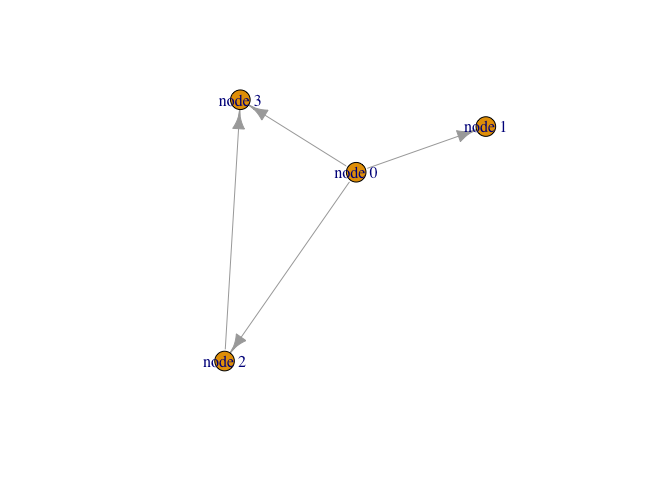
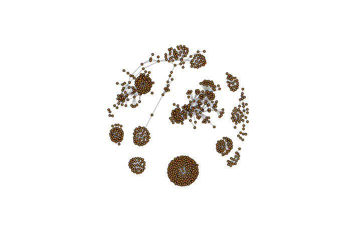
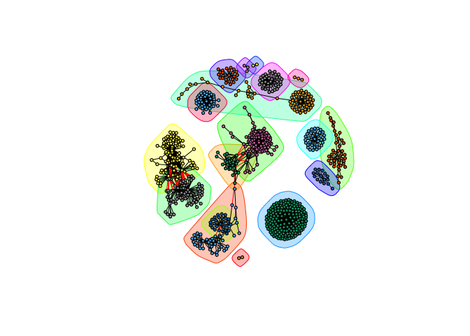

Network Analysis
================

## Coronavirus (and HW)

Here we analyze infection data for the 2019 novel Coronavirus COVID-19
(2019-nCoV) epidemic. The raw data is pulled from the Johns Hopkins
University Center for Systems Science and Engineering (JHU CCSE)
Coronavirus repository.

A CSV file is available here
<https://github.com/RamiKrispin/coronavirus-csv>

``` r
url <- "https://tinyurl.com/COVID-2019"
virus <- read.csv(url)

tail(virus)
```

    ##      Province.State      Country.Region     Lat     Long       date cases
    ## 3622       Shanghai      Mainland China 31.2020 121.4491 2020-03-10     4
    ## 3623         Shanxi      Mainland China 37.5777 112.2922 2020-03-10     4
    ## 3624        Sichuan      Mainland China 30.6171 102.7103 2020-03-10    12
    ## 3625         Taiwan Taipei and environs 23.7000 121.0000 2020-03-10     2
    ## 3626        Tianjin      Mainland China 39.3054 117.3230 2020-03-10     1
    ## 3627       Zhejiang      Mainland China 29.1832 120.0934 2020-03-10    15
    ##           type
    ## 3622 recovered
    ## 3623 recovered
    ## 3624 recovered
    ## 3625 recovered
    ## 3626 recovered
    ## 3627 recovered

``` r
#library(dplyr) #functions in dplyr:
# group_by
# summarise
# arrange
# you can build these functions on one another by using %>% 
```

> Q1. How many total cases around the world?

``` r
total <- sum(virus$cases)
total
```

    ## [1] 187075

> Q2. How many deaths linked to infected cases have there been?

``` r
table(virus$type)
```

    ## 
    ## confirmed     death recovered 
    ##      2112       274      1241

``` r
inds <- virus$type == "death"
virus[inds, ]
```

    ##                    Province.State             Country.Region       Lat
    ## 30                          Hubei             Mainland China  30.97560
    ## 60                          Hebei             Mainland China  38.04280
    ## 94                   Heilongjiang             Mainland China  47.86200
    ## 95                          Hubei             Mainland China  30.97560
    ## 133                         Hubei             Mainland China  30.97560
    ## 178                         Henan             Mainland China  33.88202
    ## 179                         Hubei             Mainland China  30.97560
    ## 180                      Shanghai             Mainland China  31.20200
    ## 222                       Beijing             Mainland China  40.18240
    ## 223                        Hainan             Mainland China  19.19590
    ## 224                         Hubei             Mainland China  30.97560
    ## 266                         Hubei             Mainland China  30.97560
    ## 305                         Henan             Mainland China  33.88202
    ## 306                       Sichuan             Mainland China  30.61710
    ## 357                  Heilongjiang             Mainland China  47.86200
    ## 358                         Hubei             Mainland China  30.97560
    ## 412                         Hubei             Mainland China  30.97560
    ## 467                     Chongqing             Mainland China  30.05720
    ## 468                         Hubei             Mainland China  30.97560
    ## 524                                              Philippines  13.00000
    ## 525                     Chongqing             Mainland China  30.05720
    ## 526                         Hubei             Mainland China  30.97560
    ## 579                         Hubei             Mainland China  30.97560
    ## 637                     Hong Kong              Hong Kong SAR  22.30000
    ## 638                         Hubei             Mainland China  30.97560
    ## 693                       Guizhou             Mainland China  26.81540
    ## 694                         Hubei             Mainland China  30.97560
    ## 695                       Tianjin             Mainland China  39.30540
    ## 756                  Heilongjiang             Mainland China  47.86200
    ## 757                         Hubei             Mainland China  30.97560
    ## 825                     Guangdong             Mainland China  23.34170
    ## 826                        Hainan             Mainland China  19.19590
    ## 827                         Henan             Mainland China  33.88202
    ## 828                         Hubei             Mainland China  30.97560
    ## 829                         Jilin             Mainland China  43.66610
    ## 893                       Beijing             Mainland China  40.18240
    ## 894                         Gansu             Mainland China  36.06110
    ## 895                  Heilongjiang             Mainland China  47.86200
    ## 896                         Henan             Mainland China  33.88202
    ## 897                         Hubei             Mainland China  30.97560
    ## 898                         Hunan             Mainland China  27.61040
    ## 963                         Anhui             Mainland China  31.82570
    ## 964                         Gansu             Mainland China  36.06110
    ## 965                       Guangxi             Mainland China  23.82980
    ## 966                        Hainan             Mainland China  19.19590
    ## 967                         Hebei             Mainland China  38.04280
    ## 968                  Heilongjiang             Mainland China  47.86200
    ## 969                         Henan             Mainland China  33.88202
    ## 970                         Hubei             Mainland China  30.97560
    ## 971                      Shandong             Mainland China  36.34270
    ## 1035                        Anhui             Mainland China  31.82570
    ## 1036                 Heilongjiang             Mainland China  47.86200
    ## 1037                        Hubei             Mainland China  30.97560
    ## 1038                      Jiangxi             Mainland China  27.61400
    ## 1099                        Anhui             Mainland China  31.82570
    ## 1100                      Beijing             Mainland China  40.18240
    ## 1101                    Chongqing             Mainland China  30.05720
    ## 1102                 Heilongjiang             Mainland China  47.86200
    ## 1103                        Henan             Mainland China  33.88202
    ## 1104                        Hubei             Mainland China  30.97560
    ## 1105                      Tianjin             Mainland China  39.30540
    ## 1172                       Hainan             Mainland China  19.19590
    ## 1173                        Henan             Mainland China  33.88202
    ## 1174                        Hunan             Mainland China  27.61040
    ## 1175                     Liaoning             Mainland China  41.29560
    ## 1176                     Shandong             Mainland China  36.34270
    ## 1251                                                   Japan  36.00000
    ## 1252                        Anhui             Mainland China  31.82570
    ## 1253                    Chongqing             Mainland China  30.05720
    ## 1254                    Guangdong             Mainland China  23.34170
    ## 1255                      Guangxi             Mainland China  23.82980
    ## 1256                        Hebei             Mainland China  38.04280
    ## 1257                 Heilongjiang             Mainland China  47.86200
    ## 1258                        Henan             Mainland China  33.88202
    ## 1259                        Hubei             Mainland China  30.97560
    ## 1260                      Tianjin             Mainland China  39.30540
    ## 1261                     Xinjiang             Mainland China  41.11290
    ## 1329                        Anhui             Mainland China  31.82570
    ## 1330                    Chongqing             Mainland China  30.05720
    ## 1331                 Heilongjiang             Mainland China  47.86200
    ## 1332                        Henan             Mainland China  33.88202
    ## 1333                        Hubei             Mainland China  30.97560
    ## 1393                                                  France  47.00000
    ## 1394                      Beijing             Mainland China  40.18240
    ## 1395                        Henan             Mainland China  33.88202
    ## 1396                        Hubei             Mainland China  30.97560
    ## 1468                        Hubei             Mainland China  30.97560
    ## 1469                        Hunan             Mainland China  27.61040
    ## 1470                      Sichuan             Mainland China  30.61710
    ## 1471                       Taiwan        Taipei and environs  23.70000
    ## 1538                    Guangdong             Mainland China  23.34170
    ## 1539                        Henan             Mainland China  33.88202
    ## 1540                        Hubei             Mainland China  30.97560
    ## 1599                      Guizhou             Mainland China  26.81540
    ## 1600                        Hebei             Mainland China  38.04280
    ## 1601                        Henan             Mainland China  33.88202
    ## 1602                        Hubei             Mainland China  30.97560
    ## 1603                        Hunan             Mainland China  27.61040
    ## 1604                     Shandong             Mainland China  36.34270
    ## 1665                              Iran (Islamic Republic of)  32.00000
    ## 1666                    Guangdong             Mainland China  23.34170
    ## 1667                 Heilongjiang             Mainland China  47.86200
    ## 1668                    Hong Kong              Hong Kong SAR  22.30000
    ## 1669                        Hubei             Mainland China  30.97560
    ## 1670                     Shanghai             Mainland China  31.20200
    ## 1671                       Yunnan             Mainland China  24.97400
    ## 1731                                       Republic of Korea  36.00000
    ## 1732                    Chongqing             Mainland China  30.05720
    ## 1733 Diamond Princess cruise ship                     Others  35.44370
    ## 1734                       Fujian             Mainland China  26.07890
    ## 1735                        Hebei             Mainland China  38.04280
    ## 1736                        Hubei             Mainland China  30.97560
    ## 1737                      Shaanxi             Mainland China  35.19170
    ## 1738                     Shandong             Mainland China  36.34270
    ## 1739                       Yunnan             Mainland China  24.97400
    ## 1740                     Zhejiang             Mainland China  29.18320
    ## 1799                              Iran (Islamic Republic of)  32.00000
    ## 1800                                                   Italy  43.00000
    ## 1801                                       Republic of Korea  36.00000
    ## 1863                              Iran (Islamic Republic of)  32.00000
    ## 1864                                                   Italy  43.00000
    ## 1865                        Hebei             Mainland China  38.04280
    ## 1866                        Hubei             Mainland China  30.97560
    ## 1867                     Shanghai             Mainland China  31.20200
    ## 1868                     Xinjiang             Mainland China  41.11290
    ## 1913                              Iran (Islamic Republic of)  32.00000
    ## 1914                                                   Italy  43.00000
    ## 1915                                       Republic of Korea  36.00000
    ## 1916 Diamond Princess cruise ship                     Others  35.44370
    ## 1917                    Guangdong             Mainland China  23.34170
    ## 1918                       Hainan             Mainland China  19.19590
    ## 1976                              Iran (Islamic Republic of)  32.00000
    ## 1977                                                   Italy  43.00000
    ## 1978                                       Republic of Korea  36.00000
    ## 1979                        Hubei             Mainland China  30.97560
    ## 1980                     Shandong             Mainland China  36.34270
    ## 2039                              Iran (Islamic Republic of)  32.00000
    ## 2040                                                   Italy  43.00000
    ## 2041                                       Republic of Korea  36.00000
    ## 2042                    Guangdong             Mainland China  23.34170
    ## 2043                        Hubei             Mainland China  30.97560
    ## 2044                     Shandong             Mainland China  36.34270
    ## 2112                                                  France  47.00000
    ## 2113                              Iran (Islamic Republic of)  32.00000
    ## 2114                                                   Italy  43.00000
    ## 2115                                                   Japan  36.00000
    ## 2116                                       Republic of Korea  36.00000
    ## 2117 Diamond Princess cruise ship                     Others  35.44370
    ## 2118                        Hubei             Mainland China  30.97560
    ## 2186                              Iran (Islamic Republic of)  32.00000
    ## 2187                                                   Italy  43.00000
    ## 2188                                                   Japan  36.00000
    ## 2189                                       Republic of Korea  36.00000
    ## 2190                      Beijing             Mainland China  40.18240
    ## 2191                 Heilongjiang             Mainland China  47.86200
    ## 2192                        Henan             Mainland China  33.88202
    ## 2193                        Hubei             Mainland China  30.97560
    ## 2260                              Iran (Islamic Republic of)  32.00000
    ## 2261                                                   Italy  43.00000
    ## 2262                      Beijing             Mainland China  40.18240
    ## 2263 Diamond Princess cruise ship                     Others  35.44370
    ## 2264                        Hubei             Mainland China  30.97560
    ## 2265                     Xinjiang             Mainland China  41.11290
    ## 2349                              Iran (Islamic Republic of)  32.00000
    ## 2350                                                   Italy  43.00000
    ## 2351                                                   Japan  36.00000
    ## 2352                                       Republic of Korea  36.00000
    ## 2353                      Beijing             Mainland China  40.18240
    ## 2354                        Henan             Mainland China  33.88202
    ## 2355                        Hubei             Mainland China  30.97560
    ## 2356              King County, WA                         US  47.60620
    ## 2438                              Iran (Islamic Republic of)  32.00000
    ## 2439                                                   Italy  43.00000
    ## 2440                                                   Japan  36.00000
    ## 2441                                       Republic of Korea  36.00000
    ## 2442                                                Thailand  15.00000
    ## 2443                        Henan             Mainland China  33.88202
    ## 2444                        Hubei             Mainland China  30.97560
    ## 2445            Western Australia                  Australia -31.95050
    ## 2533                                                  France  47.00000
    ## 2534                              Iran (Islamic Republic of)  32.00000
    ## 2535                                                   Italy  43.00000
    ## 2536                                       Republic of Korea  36.00000
    ## 2537                        Hubei             Mainland China  30.97560
    ## 2538              King County, WA                         US  47.60620
    ## 2539         Snohomish County, WA                         US  48.03300
    ## 2628                                                  France  47.00000
    ## 2629                              Iran (Islamic Republic of)  32.00000
    ## 2630                                                   Italy  43.00000
    ## 2631                                              San Marino  43.94240
    ## 2632                                                   Spain  40.00000
    ## 2633                        Hubei             Mainland China  30.97560
    ## 2634               Inner Mongolia             Mainland China  44.09350
    ## 2635              King County, WA                         US  47.60620
    ## 2728                              Iran (Islamic Republic of)  32.00000
    ## 2729                                                    Iraq  33.00000
    ## 2730                                                   Italy  43.00000
    ## 2731                                       Republic of Korea  36.00000
    ## 2732                                                   Spain  40.00000
    ## 2733                        Hubei             Mainland China  30.97560
    ## 2734              King County, WA                         US  47.60620
    ## 2735              New South Wales                  Australia -33.86880
    ## 2736            Placer County, CA                         US  39.09160
    ## 2839                                                  France  47.00000
    ## 2840                              Iran (Islamic Republic of)  32.00000
    ## 2841                                                   Italy  43.00000
    ## 2842                                                   Spain  40.00000
    ## 2843                                             Switzerland  46.81820
    ## 2844                                                      UK  55.00000
    ## 2845                       Hainan             Mainland China  19.19590
    ## 2846                        Hubei             Mainland China  30.97560
    ## 2847              King County, WA                         US  47.60620
    ## 2971                                                  France  47.00000
    ## 2972                              Iran (Islamic Republic of)  32.00000
    ## 2973                                                    Iraq  33.00000
    ## 2974                                                   Italy  43.00000
    ## 2975                                             Netherlands  52.13260
    ## 2976                                       Republic of Korea  36.00000
    ## 2977                                                   Spain  40.00000
    ## 2978                                                      UK  55.00000
    ## 2979                        Hubei             Mainland China  30.97560
    ## 2980              King County, WA                         US  47.60620
    ## 3099                                                  France  47.00000
    ## 3100                              Iran (Islamic Republic of)  32.00000
    ## 3101                                                    Iraq  33.00000
    ## 3102                                                   Italy  43.00000
    ## 3103                                       Republic of Korea  36.00000
    ## 3104                                                   Spain  40.00000
    ## 3105                        Hubei             Mainland China  30.97560
    ## 3106              King County, WA                         US  47.60620
    ## 3255                                               Argentina -38.41610
    ## 3256                                                   Egypt  26.00000
    ## 3257                                                  France  47.00000
    ## 3258                              Iran (Islamic Republic of)  32.00000
    ## 3259                                                    Iraq  33.00000
    ## 3260                                                   Italy  43.00000
    ## 3261                                             Netherlands  52.13260
    ## 3262                                       Republic of Korea  36.00000
    ## 3263                                                   Spain  40.00000
    ## 3264                                             Switzerland  46.81820
    ## 3265                                                      UK  55.00000
    ## 3266                    Hong Kong              Hong Kong SAR  22.30000
    ## 3267                        Hubei             Mainland China  30.97560
    ## 3268              King County, WA                         US  47.60620
    ## 3269               Lee County, FL                         US  26.66300
    ## 3270              New South Wales                  Australia -33.86880
    ## 3271        Santa Rosa County, FL                         US  30.76900
    ## 3378                                                 Germany  51.00000
    ## 3379                              Iran (Islamic Republic of)  32.00000
    ## 3380                                                   Italy  43.00000
    ## 3381                                                   Japan  36.00000
    ## 3382                                       Republic of Korea  36.00000
    ## 3383                                                   Spain  40.00000
    ## 3384                                                      UK  55.00000
    ## 3385             British Columbia                     Canada  49.28270
    ## 3386             Grant County, WA                         US  47.19810
    ## 3387                    Guangdong             Mainland China  23.34170
    ## 3388                        Hubei             Mainland China  30.97560
    ## 3575                                                  France  47.00000
    ## 3576                              Iran (Islamic Republic of)  32.00000
    ## 3577                                                    Iraq  33.00000
    ## 3578                                                   Italy  43.00000
    ## 3579                                                 Lebanon  33.85470
    ## 3580                                                 Morocco  31.79170
    ## 3581                                             Netherlands  52.13260
    ## 3582                                       Republic of Korea  36.00000
    ## 3583                                              San Marino  43.94240
    ## 3584                                                   Spain  40.00000
    ## 3585                                             Switzerland  46.81820
    ## 3586                                                      UK  55.00000
    ## 3587            Bergen County, NJ                         US  40.92630
    ## 3588                        Hubei             Mainland China  30.97560
    ## 3589              King County, WA                         US  47.60620
    ## 3590       Santa Clara County, CA                         US  37.35410
    ##           Long       date cases  type
    ## 30    112.2707 2020-01-22    17 death
    ## 60    114.5149 2020-01-23     1 death
    ## 94    127.7615 2020-01-24     1 death
    ## 95    112.2707 2020-01-24     7 death
    ## 133   112.2707 2020-01-25    16 death
    ## 178   113.6140 2020-01-26     1 death
    ## 179   112.2707 2020-01-26    12 death
    ## 180   121.4491 2020-01-26     1 death
    ## 222   116.4142 2020-01-27     1 death
    ## 223   109.7453 2020-01-27     1 death
    ## 224   112.2707 2020-01-27    24 death
    ## 266   112.2707 2020-01-28    49 death
    ## 305   113.6140 2020-01-29     1 death
    ## 306   102.7103 2020-01-29     1 death
    ## 357   127.7615 2020-01-30     1 death
    ## 358   112.2707 2020-01-30    37 death
    ## 412   112.2707 2020-01-31    42 death
    ## 467   107.8740 2020-02-01     1 death
    ## 468   112.2707 2020-02-01    45 death
    ## 524   122.0000 2020-02-02     1 death
    ## 525   107.8740 2020-02-02     1 death
    ## 526   112.2707 2020-02-02   101 death
    ## 579   112.2707 2020-02-03    64 death
    ## 637   114.2000 2020-02-04     1 death
    ## 638   112.2707 2020-02-04    65 death
    ## 693   106.8748 2020-02-05     1 death
    ## 694   112.2707 2020-02-05    70 death
    ## 695   117.3230 2020-02-05     1 death
    ## 756   127.7615 2020-02-06     1 death
    ## 757   112.2707 2020-02-06    69 death
    ## 825   113.4244 2020-02-07     1 death
    ## 826   109.7453 2020-02-07     1 death
    ## 827   113.6140 2020-02-07     1 death
    ## 828   112.2707 2020-02-07    81 death
    ## 829   126.1923 2020-02-07     1 death
    ## 893   116.4142 2020-02-08     1 death
    ## 894   103.8343 2020-02-08     1 death
    ## 895   127.7615 2020-02-08     2 death
    ## 896   113.6140 2020-02-08     1 death
    ## 897   112.2707 2020-02-08    81 death
    ## 898   111.7088 2020-02-08     1 death
    ## 963   117.2264 2020-02-09     1 death
    ## 964   103.8343 2020-02-09     1 death
    ## 965   108.7881 2020-02-09     1 death
    ## 966   109.7453 2020-02-09     1 death
    ## 967   114.5149 2020-02-09     1 death
    ## 968   127.7615 2020-02-09     1 death
    ## 969   113.6140 2020-02-09     2 death
    ## 970   112.2707 2020-02-09    91 death
    ## 971   118.1498 2020-02-09     1 death
    ## 1035  117.2264 2020-02-10     2 death
    ## 1036  127.7615 2020-02-10     1 death
    ## 1037  112.2707 2020-02-10   103 death
    ## 1038  115.7221 2020-02-10     1 death
    ## 1099  117.2264 2020-02-11     1 death
    ## 1100  116.4142 2020-02-11     1 death
    ## 1101  107.8740 2020-02-11     1 death
    ## 1102  127.7615 2020-02-11     1 death
    ## 1103  113.6140 2020-02-11     1 death
    ## 1104  112.2707 2020-02-11    94 death
    ## 1105  117.3230 2020-02-11     1 death
    ## 1172  109.7453 2020-02-12     1 death
    ## 1173  113.6140 2020-02-12     1 death
    ## 1174  111.7088 2020-02-12     1 death
    ## 1175  122.6085 2020-02-12     1 death
    ## 1176  118.1498 2020-02-12     1 death
    ## 1251  138.0000 2020-02-13     1 death
    ## 1252  117.2264 2020-02-13     1 death
    ## 1253  107.8740 2020-02-13     1 death
    ## 1254  113.4244 2020-02-13     1 death
    ## 1255  108.7881 2020-02-13     1 death
    ## 1256  114.5149 2020-02-13     1 death
    ## 1257  127.7615 2020-02-13     1 death
    ## 1258  113.6140 2020-02-13     2 death
    ## 1259  112.2707 2020-02-13   242 death
    ## 1260  117.3230 2020-02-13     1 death
    ## 1261   85.2401 2020-02-13     1 death
    ## 1329  117.2264 2020-02-14     1 death
    ## 1330  107.8740 2020-02-14     1 death
    ## 1331  127.7615 2020-02-14     2 death
    ## 1332  113.6140 2020-02-14     1 death
    ## 1333  112.2707 2020-02-14   147 death
    ## 1393    2.0000 2020-02-15     1 death
    ## 1394  116.4142 2020-02-15     1 death
    ## 1395  113.6140 2020-02-15     2 death
    ## 1396  112.2707 2020-02-15   139 death
    ## 1468  112.2707 2020-02-16   100 death
    ## 1469  111.7088 2020-02-16     1 death
    ## 1470  102.7103 2020-02-16     2 death
    ## 1471  121.0000 2020-02-16     1 death
    ## 1538  113.4244 2020-02-17     2 death
    ## 1539  113.6140 2020-02-17     3 death
    ## 1540  112.2707 2020-02-17    93 death
    ## 1599  106.8748 2020-02-18     1 death
    ## 1600  114.5149 2020-02-18     1 death
    ## 1601  113.6140 2020-02-18     3 death
    ## 1602  112.2707 2020-02-18   132 death
    ## 1603  111.7088 2020-02-18     1 death
    ## 1604  118.1498 2020-02-18     1 death
    ## 1665   53.0000 2020-02-19     2 death
    ## 1666  113.4244 2020-02-19     1 death
    ## 1667  127.7615 2020-02-19     1 death
    ## 1668  114.2000 2020-02-19     1 death
    ## 1669  112.2707 2020-02-19   108 death
    ## 1670  121.4491 2020-02-19     1 death
    ## 1671  101.4870 2020-02-19     1 death
    ## 1731  128.0000 2020-02-20     1 death
    ## 1732  107.8740 2020-02-20     1 death
    ## 1733  139.6380 2020-02-20     2 death
    ## 1734  117.9874 2020-02-20     1 death
    ## 1735  114.5149 2020-02-20     1 death
    ## 1736  112.2707 2020-02-20   115 death
    ## 1737  108.8701 2020-02-20     1 death
    ## 1738  118.1498 2020-02-20     1 death
    ## 1739  101.4870 2020-02-20     1 death
    ## 1740  120.0934 2020-02-20     1 death
    ## 1799   53.0000 2020-02-21     2 death
    ## 1800   12.0000 2020-02-21     1 death
    ## 1801  128.0000 2020-02-21     1 death
    ## 1863   53.0000 2020-02-22     1 death
    ## 1864   12.0000 2020-02-22     1 death
    ## 1865  114.5149 2020-02-22     1 death
    ## 1866  112.2707 2020-02-22   202 death
    ## 1867  121.4491 2020-02-22     1 death
    ## 1868   85.2401 2020-02-22     1 death
    ## 1913   53.0000 2020-02-23     3 death
    ## 1914   12.0000 2020-02-23     1 death
    ## 1915  128.0000 2020-02-23     4 death
    ## 1916  139.6380 2020-02-23     1 death
    ## 1917  113.4244 2020-02-23     1 death
    ## 1918  109.7453 2020-02-23     1 death
    ## 1976   53.0000 2020-02-24     4 death
    ## 1977   12.0000 2020-02-24     4 death
    ## 1978  128.0000 2020-02-24     2 death
    ## 1979  112.2707 2020-02-24   149 death
    ## 1980  118.1498 2020-02-24     1 death
    ## 2039   53.0000 2020-02-25     4 death
    ## 2040   12.0000 2020-02-25     3 death
    ## 2041  128.0000 2020-02-25     2 death
    ## 2042  113.4244 2020-02-25     1 death
    ## 2043  112.2707 2020-02-25    68 death
    ## 2044  118.1498 2020-02-25     1 death
    ## 2112    2.0000 2020-02-26     1 death
    ## 2113   53.0000 2020-02-26     3 death
    ## 2114   12.0000 2020-02-26     2 death
    ## 2115  138.0000 2020-02-26     1 death
    ## 2116  128.0000 2020-02-26     2 death
    ## 2117  139.6380 2020-02-26     1 death
    ## 2118  112.2707 2020-02-26    52 death
    ## 2186   53.0000 2020-02-27     7 death
    ## 2187   12.0000 2020-02-27     5 death
    ## 2188  138.0000 2020-02-27     2 death
    ## 2189  128.0000 2020-02-27     1 death
    ## 2190  116.4142 2020-02-27     1 death
    ## 2191  127.7615 2020-02-27     1 death
    ## 2192  113.6140 2020-02-27     1 death
    ## 2193  112.2707 2020-02-27    26 death
    ## 2260   53.0000 2020-02-28     8 death
    ## 2261   12.0000 2020-02-28     4 death
    ## 2262  116.4142 2020-02-28     2 death
    ## 2263  139.6380 2020-02-28     2 death
    ## 2264  112.2707 2020-02-28    41 death
    ## 2265   85.2401 2020-02-28     1 death
    ## 2349   53.0000 2020-02-29     9 death
    ## 2350   12.0000 2020-02-29     8 death
    ## 2351  138.0000 2020-02-29     1 death
    ## 2352  128.0000 2020-02-29     3 death
    ## 2353  116.4142 2020-02-29     1 death
    ## 2354  113.6140 2020-02-29     1 death
    ## 2355  112.2707 2020-02-29    45 death
    ## 2356 -122.3321 2020-02-29     1 death
    ## 2438   53.0000 2020-03-01    11 death
    ## 2439   12.0000 2020-03-01     5 death
    ## 2440  138.0000 2020-03-01     1 death
    ## 2441  128.0000 2020-03-01     1 death
    ## 2442  101.0000 2020-03-01     1 death
    ## 2443  113.6140 2020-03-01     1 death
    ## 2444  112.2707 2020-03-01    34 death
    ## 2445  115.8605 2020-03-01     1 death
    ## 2533    2.0000 2020-03-02     1 death
    ## 2534   53.0000 2020-03-02    12 death
    ## 2535   12.0000 2020-03-02    18 death
    ## 2536  128.0000 2020-03-02    11 death
    ## 2537  112.2707 2020-03-02    42 death
    ## 2538 -122.3321 2020-03-02     4 death
    ## 2539 -121.8339 2020-03-02     1 death
    ## 2628    2.0000 2020-03-03     1 death
    ## 2629   53.0000 2020-03-03    11 death
    ## 2630   12.0000 2020-03-03    27 death
    ## 2631   12.4578 2020-03-03     1 death
    ## 2632   -4.0000 2020-03-03     1 death
    ## 2633  112.2707 2020-03-03    32 death
    ## 2634  113.9448 2020-03-03     1 death
    ## 2635 -122.3321 2020-03-03     1 death
    ## 2728   53.0000 2020-03-04    15 death
    ## 2729   44.0000 2020-03-04     2 death
    ## 2730   12.0000 2020-03-04    28 death
    ## 2731  128.0000 2020-03-04     7 death
    ## 2732   -4.0000 2020-03-04     1 death
    ## 2733  112.2707 2020-03-04    36 death
    ## 2734 -122.3321 2020-03-04     3 death
    ## 2735  151.2093 2020-03-04     1 death
    ## 2736 -120.8039 2020-03-04     1 death
    ## 2839    2.0000 2020-03-05     2 death
    ## 2840   53.0000 2020-03-05    15 death
    ## 2841   12.0000 2020-03-05    41 death
    ## 2842   -4.0000 2020-03-05     1 death
    ## 2843    8.2275 2020-03-05     1 death
    ## 2844   -3.0000 2020-03-05     1 death
    ## 2845  109.7453 2020-03-05     1 death
    ## 2846  112.2707 2020-03-05    31 death
    ## 2847 -122.3321 2020-03-05     1 death
    ## 2971    2.0000 2020-03-06     3 death
    ## 2972   53.0000 2020-03-06    17 death
    ## 2973   44.0000 2020-03-06     1 death
    ## 2974   12.0000 2020-03-06    49 death
    ## 2975    5.2913 2020-03-06     1 death
    ## 2976  128.0000 2020-03-06     7 death
    ## 2977   -4.0000 2020-03-06     2 death
    ## 2978   -3.0000 2020-03-06     1 death
    ## 2979  112.2707 2020-03-06    29 death
    ## 2980 -122.3321 2020-03-06     2 death
    ## 3099    2.0000 2020-03-07     2 death
    ## 3100   53.0000 2020-03-07    21 death
    ## 3101   44.0000 2020-03-07     1 death
    ## 3102   12.0000 2020-03-07    36 death
    ## 3103  128.0000 2020-03-07     2 death
    ## 3104   -4.0000 2020-03-07     5 death
    ## 3105  112.2707 2020-03-07    28 death
    ## 3106 -122.3321 2020-03-07     3 death
    ## 3255  -63.6167 2020-03-08     1 death
    ## 3256   30.0000 2020-03-08     1 death
    ## 3257    2.0000 2020-03-08     8 death
    ## 3258   53.0000 2020-03-08    49 death
    ## 3259   44.0000 2020-03-08     2 death
    ## 3260   12.0000 2020-03-08   133 death
    ## 3261    5.2913 2020-03-08     2 death
    ## 3262  128.0000 2020-03-08     6 death
    ## 3263   -4.0000 2020-03-08     7 death
    ## 3264    8.2275 2020-03-08     1 death
    ## 3265   -3.0000 2020-03-08     1 death
    ## 3266  114.2000 2020-03-08     1 death
    ## 3267  112.2707 2020-03-08    27 death
    ## 3268 -122.3321 2020-03-08     2 death
    ## 3269  -81.9535 2020-03-08     1 death
    ## 3270  151.2093 2020-03-08     1 death
    ## 3271  -86.9824 2020-03-08     1 death
    ## 3378    9.0000 2020-03-09     2 death
    ## 3379   53.0000 2020-03-09    43 death
    ## 3380   12.0000 2020-03-09    97 death
    ## 3381  138.0000 2020-03-09     4 death
    ## 3382  128.0000 2020-03-09     3 death
    ## 3383   -4.0000 2020-03-09    11 death
    ## 3384   -3.0000 2020-03-09     1 death
    ## 3385 -123.1207 2020-03-09     1 death
    ## 3386 -119.3732 2020-03-09     1 death
    ## 3387  113.4244 2020-03-09     1 death
    ## 3388  112.2707 2020-03-09    22 death
    ## 3575    2.0000 2020-03-10    14 death
    ## 3576   53.0000 2020-03-10    54 death
    ## 3577   44.0000 2020-03-10     1 death
    ## 3578   12.0000 2020-03-10   168 death
    ## 3579   35.8623 2020-03-10     1 death
    ## 3580   -7.0926 2020-03-10     1 death
    ## 3581    5.2913 2020-03-10     1 death
    ## 3582  128.0000 2020-03-10     1 death
    ## 3583   12.4578 2020-03-10     1 death
    ## 3584   -4.0000 2020-03-10     7 death
    ## 3585    8.2275 2020-03-10     1 death
    ## 3586   -3.0000 2020-03-10     2 death
    ## 3587  -74.0770 2020-03-10     1 death
    ## 3588  112.2707 2020-03-10    16 death
    ## 3589 -122.3321 2020-03-10     4 death
    ## 3590 -121.9552 2020-03-10     1 death

``` r
totaldeaths <- sum(virus[inds, "cases"])
totaldeaths
```

    ## [1] 4262

> Q3. What is the overall dealth rate?

``` r
round(totaldeaths/total * 100, 2)
```

    ## [1] 2.28

> Q4. What is the death rate in Mainland China?

``` r
totalchina <- virus$Country.Region == "Mainland China"
tc<- sum(virus[totalchina, "cases"])

chinadeath <- virus$type == "death" & virus$Country.Region == "Mainland China"
cd<- sum(virus[chinadeath, "cases" ])

round(cd/tc * 100, 2)
```

    ## [1] 2.18

> Q5. What is the death rate in Italy, Iran, and the US?

``` r
#Italy

totalitaly <- virus$Country.Region == "Italy"
ti<- sum(virus[totalitaly, "cases"])

italydeath <- virus$type == "death" & virus$Country.Region == "Italy"
id<- sum(virus[italydeath, "cases" ])

round(id/ti * 100, 2)
```

    ## [1] 5.49

``` r
#Iran

totaliran <- virus$Country.Region == "Iran"
tir<- sum(virus[totaliran, "cases"])

irandeath <- virus$type == "death" & virus$Country.Region == "Iran"
ird<- sum(virus[irandeath, "cases" ])

round(ird/tir * 100, 2)
```

    ## [1] NaN

``` r
#US

totalUS <- virus$Country.Region == "US"
tUS<- sum(virus[totalUS, "cases"])

USdeath <- virus$type == "death" & virus$Country.Region == "US"
USd<- sum(virus[USdeath, "cases" ])

round(USd/tUS * 100, 2)
```

    ## [1] 3.45

## PT 2 Metagenomics co-occurrence networks

Install packages

``` r
# BiocManager::install("RCy3") run in console
```

``` r
library(RCy3)
library(igraph)
```

    ## 
    ## Attaching package: 'igraph'

    ## The following objects are masked from 'package:stats':
    ## 
    ##     decompose, spectrum

    ## The following object is masked from 'package:base':
    ## 
    ##     union

``` r
library(RColorBrewer)
```

Can we talk to cytoscape from R

``` r
cytoscapePing()
```

    ## [1] "You are connected to Cytoscape!"

We can test things further by making a small sample network (here in
igraph format as used by the R igraph package) and sending it to
Cytoscape:

``` r
g <- makeSimpleIgraph()
createNetworkFromIgraph(g,"myGraph")
```

    ## Loading data...
    ## Applying default style...
    ## Applying preferred layout...

    ## networkSUID 
    ##        9772

Switching Styles

``` r
setVisualStyle("Marquee")
```

    ##                 message 
    ## "Visual Style applied."

Lets save an image from cytoscape and include it in this document

``` r
fig <- exportImage(filename="demo_marquee", type="png", height=350)
```

    ## Warning: This file already exists. A Cytoscape popup 
    ##                 will be generated to confirm overwrite.

``` r
knitr::include_graphics("./demo_marquee.png")
```


``` r
plot(g)
```

<!-- -->

\#\#Read our metagenomics data

We will read in a species co-occurrence matrix that was calculated using
Spearman Rank coefficient. (see reference Lima-Mendez et al. (2015) for
details).

``` r
## scripts for processing located in "inst/data-raw/"
prok_vir_cor <- read.delim("virus_prok_cor_abundant.tsv", stringsAsFactors = FALSE)

## Have a peak at the first 6 rows
head(prok_vir_cor)
```

    ##       Var1          Var2    weight
    ## 1  ph_1061 AACY020068177 0.8555342
    ## 2  ph_1258 AACY020207233 0.8055750
    ## 3  ph_3164 AACY020207233 0.8122517
    ## 4  ph_1033 AACY020255495 0.8487498
    ## 5 ph_10996 AACY020255495 0.8734617
    ## 6 ph_11038 AACY020255495 0.8740782

``` r
g <- graph.data.frame(prok_vir_cor, directed = FALSE)
plot(g) #a mess
```

<!-- -->

This is a hot-mess\! Lets turn off the blue text labels. And The
nodes/vertex are too big. Lets make them smaller…

``` r
plot(g, vertex.size=3, vertex.label=NA)
```

<!-- -->

We can send this to cytoscape

``` r
createNetworkFromIgraph(g,"myIgraph")
```

    ## Loading data...
    ## Applying default style...
    ## Applying preferred layout...

    ## networkSUID 
    ##        9800

Network community detection

Community structure detection algorithms try to find dense sub-graphs
within larger network graphs (i.e. clusters of well connected nodes that
are densely connected themselves but sparsely connected to other nodes
outside the cluster) . Here we use the classic Girvan & Newman
betweenness clustering method. The igraph package has lots of different
community detection algorithms (i.e. different methods for finding
communities).

``` r
cb <- cluster_edge_betweenness(g)
```

    ## Warning in cluster_edge_betweenness(g): At community.c:460 :Membership vector
    ## will be selected based on the lowest modularity score.

    ## Warning in cluster_edge_betweenness(g): At community.c:467 :Modularity
    ## calculation with weighted edge betweenness community detection might not make
    ## sense -- modularity treats edge weights as similarities while edge betwenness
    ## treats them as distances

``` r
cb
```

    ## IGRAPH clustering edge betweenness, groups: 18, mod: 0.82
    ## + groups:
    ##   $`1`
    ##   [1] "ph_1061"       "AACY020068177"
    ##   
    ##   $`2`
    ##    [1] "ph_1258"       "ph_5861"       "ph_7172"       "ph_11569"     
    ##    [5] "ph_1291"       "ph_1600"       "ph_2702"       "ph_5790"      
    ##    [9] "ph_5858"       "ph_7594"       "ph_7816"       "ph_784"       
    ##   [13] "ph_1359"       "ph_1534"       "ph_1874"       "ph_2465"      
    ##   [17] "ph_5453"       "ph_900"        "ph_908"        "ph_811"       
    ##   [21] "ph_1367"       "ph_1452"       "ph_1458"       "ph_1723"      
    ##   + ... omitted several groups/vertices

``` r
plot(cb, y=g, vertex.label=NA,  vertex.size=3)
```

<!-- -->

## Notes

``` r
# pipe writing
# dress(wash(wake("barry"))) # hard to read when things get really long

# %>%  can help visually separate the function, applies function to the x you specified in the first line

# wake("barry") %>% 
#  wash %>% 
#  dress %>% 
```
