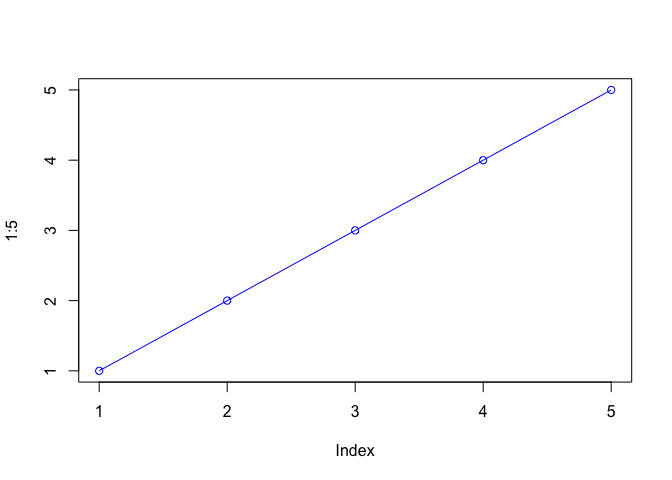
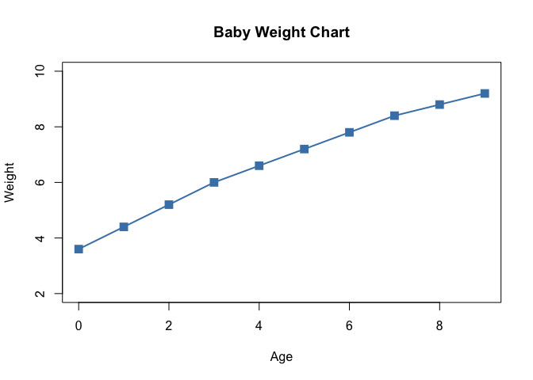
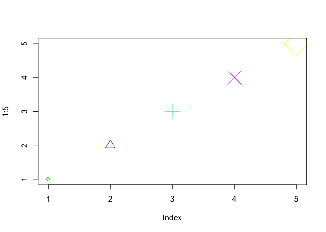
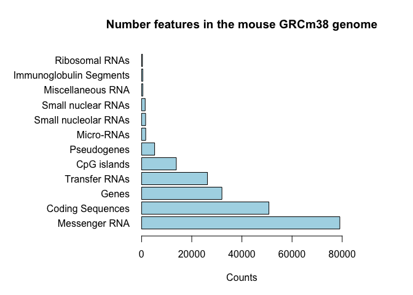
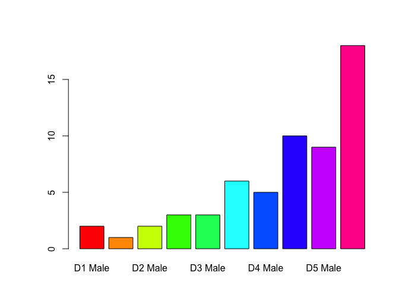

Class 5: Data visualization and graphics in R
================
Rimma Levina
Jan, 2020

``` r
# Class 5
# Data visualization and graphics in R


# baby weight data
plot(1:5, col ="blue", typ = "o")
```

<!-- -->

``` r
babychart <- read.table("bimm143_05_rstats/weight_chart.txt", header = TRUE)

plot(babychart$Age, babychart$Weight, type = "o", col="steel blue", pch=15, 
     cex = 1.5, lwd=2, ylim=c(2,10), xlab = "Age", ylab="Weight", main = "Baby Weight Chart")
```

<!-- -->

``` r
plot(1:5, pch = 1:5, cex=1:5, col=3:8)
```

<!-- -->

``` r
# feature counts data
# notice that the field separator of this file is tab, so you have to indicate that in "sep"

mousechart <- read.table("bimm143_05_rstats/feature_counts.txt", header = TRUE, sep = "\t")
mousechart
```

    ##                    Feature Count
    ## 1            Messenger RNA 79049
    ## 2         Coding Sequences 50770
    ## 3                    Genes 32029
    ## 4            Transfer RNAs 26248
    ## 5              CpG islands 13840
    ## 6              Pseudogenes  5195
    ## 7               Micro-RNAs  1638
    ## 8     Small nucleolar RNAs  1602
    ## 9       Small nuclear RNAs  1431
    ## 10       Miscellaneous RNA   491
    ## 11 Immunoglobulin Segments   474
    ## 12          Ribosomal RNAs   341

``` r
dotchart(mousechart$Count, labels = mousechart$Feature) # the file you read in needs to be a vector
```

<!-- -->

``` r
# ?par will help 
# having par determined before your graph code will apply it to the graph
par(mar = c(5, 12, 4, 6)) # set your parameters of the graph, mar stands for margins

barplot(mousechart$Count, names.arg = mousechart$Feature, 
        horiz = TRUE, xlab = "Counts", las = 1, xlim = c(0, 80000), 
        main = "Number features in the mouse GRCm38 genome", col = "light blue")
```

<!-- -->

``` r
# playing with male female plot, using color

MFcounta <- read.table("bimm143_05_rstats/male_female_counts.txt", header = TRUE, sep = "\t") #this
#this works but in read.table you have to set all the arguments, read.csv or .delim just call read.table
#but have preset arguments to save time

MFcountb <- read.delim("bimm143_05_rstats/male_female_counts.txt") #this give you the same thing as above

# par()$mar gives you the default of the margins you need
#can do x <- par()$mar

par(mar=c(3, 6, 4, 2))

barplot(MFcountb$Count, names.arg = MFcountb$Sample, col = rainbow(10))#or col=c("red", "blue") will alternate too

barplot(MFcountb$Count, names.arg = MFcountb$Sample, col = rainbow(nrow(MFcountb))) #will update the number
```

<!-- -->

``` r
#of rainbow colors used as you increase the number of rows in your data set

x <- 5
y <- 7
!(!(x < 4) & !!!(y > 12))
```

    ## [1] FALSE

``` r
library(rlang)
```
